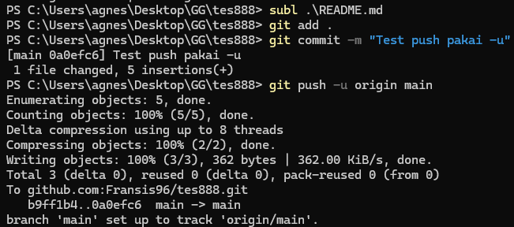

# tes888

> [!Note]
> Ini hanya uji coba.

#### Tes123 

- Test push **pakai ``-u origin main``**  ✔️  

- Test pull **tanpa ``origin main``**  ✔️  
 

- Test push **tanpa ``origin main``**  ✔️  
  

#### Tes Pull request & marge  

- Tes push dari branch ``master`` pakai ``-u origin``  
- Tes push dari branch ``master`` tanpa ``origin``  